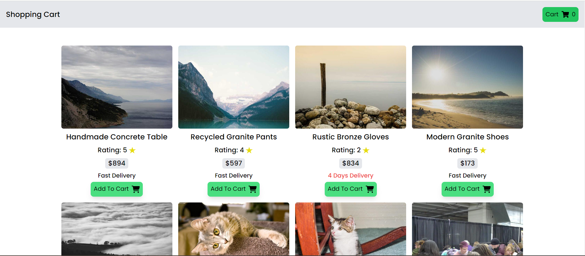
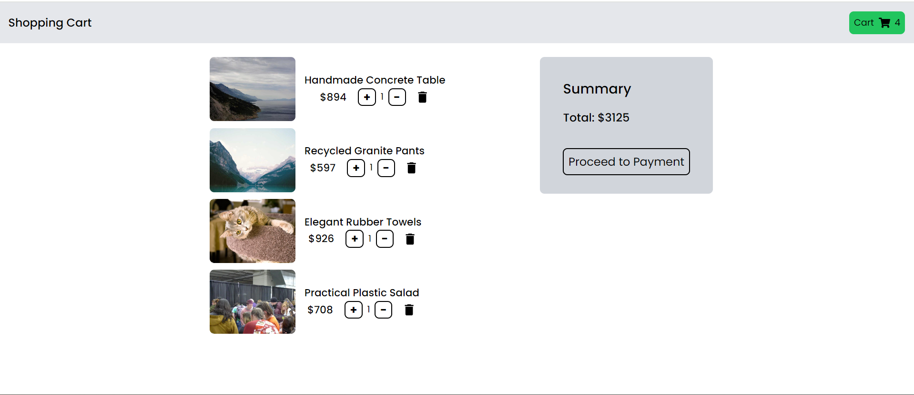

# Mini Shopping Cart With Context API and UseReducer Hook

## Preview Of App :)

## Preview Of Cart Page :)

## Description

This is a mini shopping cart application built using React.js, Context API, and the useReducer hook. It allows users to browse through a list of products, add them to their cart, and increment or decrement the quantity of each product in the cart. The app provides a seamless shopping experience with features such as product quantity management and a simple user interface.

## Features

- Browse through a list of products
- Add products to the shopping cart
- Increment or decrement the quantity of products in the cart
- Simple and intuitive user interface

## Installation

1. Clone the repository: `git clone <repository-url>`
2. Install dependencies: `npm install`
3. Start the development server: `npm start`

## Usage

1. Browse through the list of products available in the app.
2. Click on the "Add to Cart" button to add a product to your shopping cart.
3. Use the "+" and "-" buttons to adjust the quantity of each product in the cart.
4. View your updated shopping cart with the adjusted quantities.

## Technologies Used

- React.js
- Context API
- useReducer Hook
- React-Icons
- @faker.js/faker
- TailwindCSS

## Credits

This project was created by { Amandeep Singh }.
